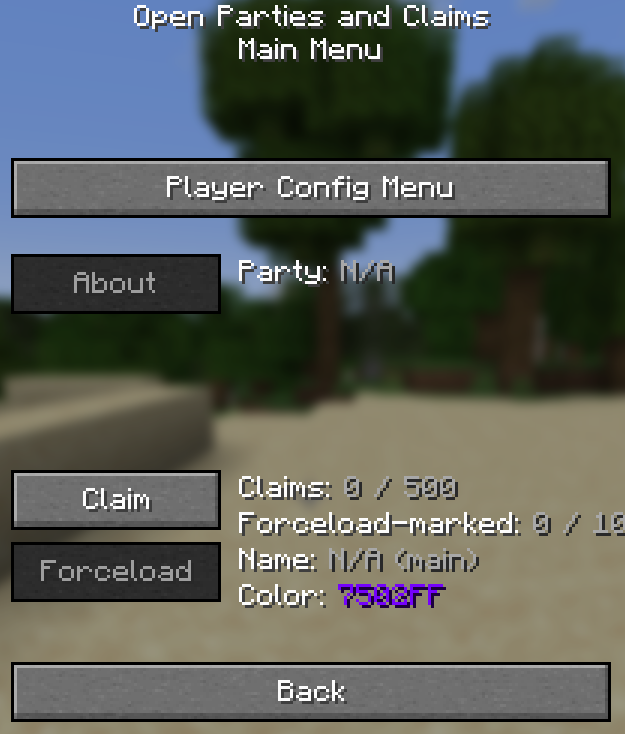

# Claims

To open the main GUI the default key is `'`. That will open the GUI shown below.

## Claiming

Pressing the `Claim` button will claim the chunk you are stood in and pressing the `Forceload` button will make the chunk constantly loaded even if someone is not in the area.

## Config
By clicking `Player Config Menu` and then `My Player Config` it will take you to your configuration. The settings are all pretty self explanatory so just have a look at them and see if there is anything you'd like to change. If you are planning on owning your own nation i would reccomend changing the `Party Name` option.

## Parties
Parties are slightly more complicated as you need to run commands instead of using a GUI for them. All party commands will start with:
`/openpac-parties`
### Creating a party
Creating a party is simple as you just need to run `/openpac-parties create`. It will take the name you set withing your player config for the party name.

You can run the command `/openpac-parties about` to find information about your party such as it's name and players.
### Handling members
#### Inviting members
To invite a player you need to run the command `/openpac-parties member invite <PlayerName>` which will then send them and invite for them to accept or deny
#### Kicking members
To kick a member you need to run the command `/openpac-parties member kick <PlayerName>` which will then force them out of your party
#### Member ranks
You can change the rank of a member by running the command `/openpac-parties member rank <Rank> <PlayerName>`.

The options for ranks are:

* MEMBER
* MODERATOR
* ADMIN
